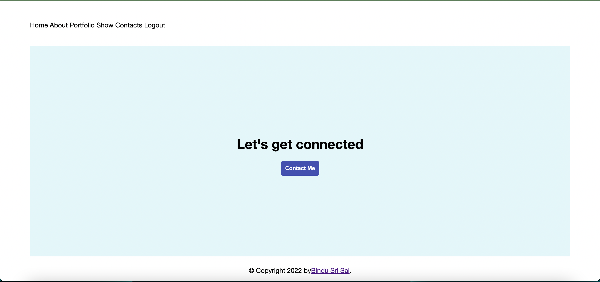
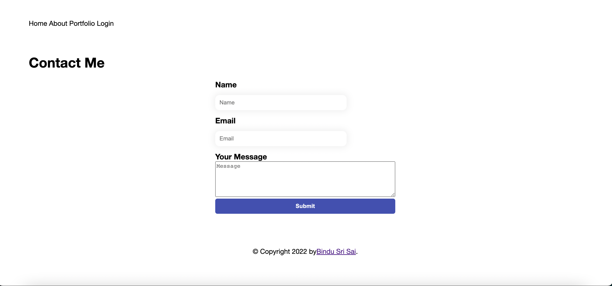
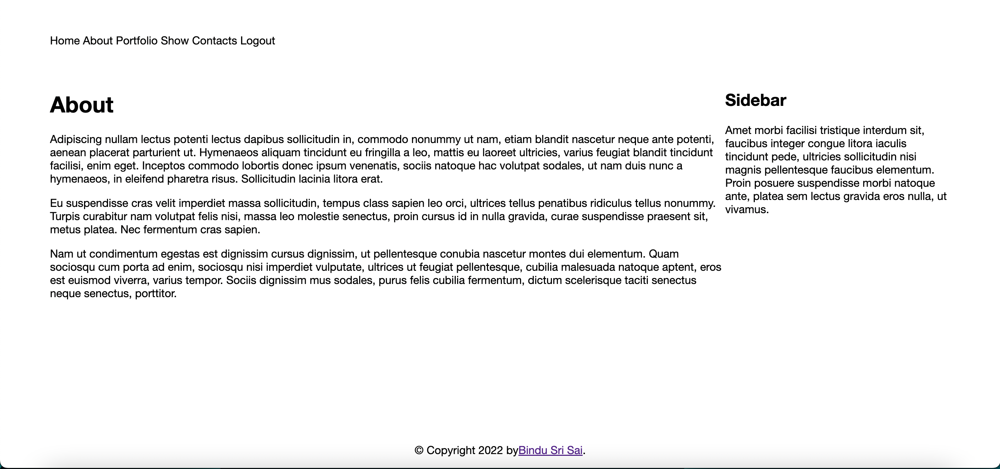
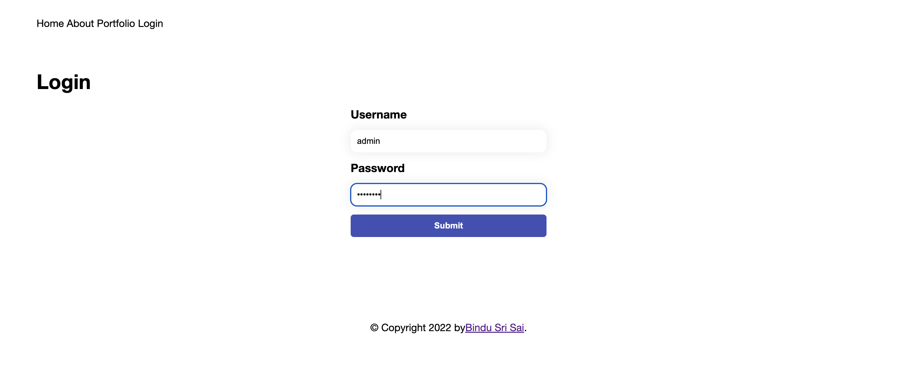
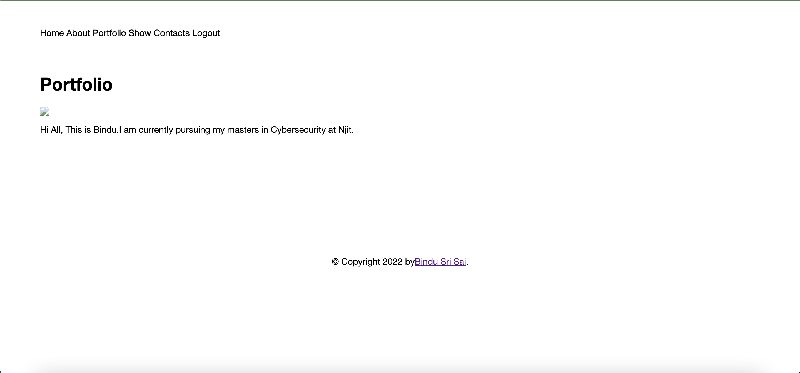
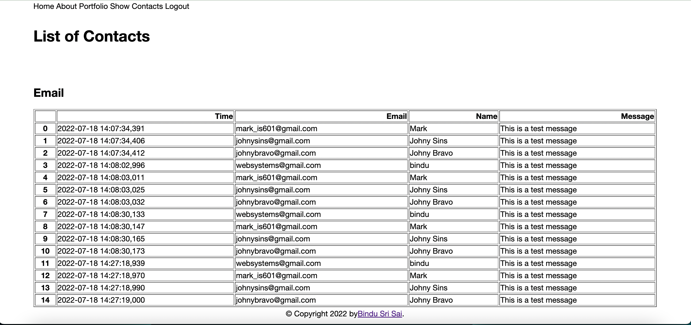

# Project 1 - Complete Website with Login and Data Display

### Name: Bindu Sri Sai Uppalapati

### UCID: bu29

### Put Pictures of Your Website Here:

1. [Homepage](homepage.png)
    
2. [Contact Form](contact.png)
    
3. [About Page](about.png)
    
4. [Login](login.png)
    
5. [Portfolio](portfolio.png)
     
6. [Contact List](contact_list.png)
     

* Note:  You can use PNG or JPG files. You need to make the filename for your photos correct and make it so that I can
  click on them to view the photo of that web page.

## Introduction

The purpose of this project is to create a very simple but complete website that includes an admin login to view the
users that have filled out the contact form. I have provided you the website and your job is to write the tests for task
1-8 using the [AAA testing methodology](https://jamescooke.info/arrange-act-assert-pattern-for-python-developers.html).

You can practice CSS with this project; however, I will be giving you a new program in the next unit. Focus on the
testing that is required to make sure that all the features of this website are tested.

### Assignment video - [here](https://youtu.be/oh0c5D7pI4Y)

### Articles to read

1. Understanding Sessions [here](https://www.bitspedia.com/2012/05/how-session-works-in-web-applications.html)
2. AAA Testing with Python [here](https://jamescooke.info/arrange-act-assert-pattern-for-python-developers.html)
3. Passing data to Jinja
   Template [here](https://www.analyticsvidhya.com/blog/2022/04/the-ultimate-guide-to-master-jinja-template/)

## Project Tasks

### Test Task 1 - 8 Instructions (10 Points Each):

1. task 1 - Make tests that check that the website loads and the main menu is displayed. 
2. task 2 - Make tests that the correct information is displayed on the index page (just a word will be sufficient)
3. task 3 - Make a test that the about page loads (just a word will be sufficient)
4. task 4 - Make a test that the portfolio page loads (just a word will be sufficient)
5. task 5 - Make a test that the login form displays and that you can log in to the site with a post request.
6. task 6 - Make a test to show that you can log in and that after log in it shows the show contact page
7. task 7 - Make a test that the thanks page displays after filling out the contact form
8. task 8 - Make a test that the contact form displays and a test that the contact form submit works

### Project Grading Rubric

1. Task 1-8 @ 5 Points a piece = 40 Points
2. Your tests must be valid and logical. You need to demonstrate AAA testing with each test. You can have more than one
   test function per file. = 30 Points
3. Realistic look and good appearance of your website = 20 Points
4. Following Submission Instructions = 10 Points

* Total Points = 100

## Submission Instructions

1. Put your name in the README.MD as indicated above. If you don't do this you will get a 0.
2. Put Photos of your website as listed above.
3. Submit a link to your GitHub Classroom repository to the Canvas assignment i.e. the one with your GitHub ID in it

## Project Install

1. Clone the repo, do pip install -r requirements.txt, and then pytest --pylint all the tests pass
2. Run pytest --pylint to see that the test tasks are failing currently and that you need to complete them
3. Setup Pycharm run configuration for flask 
